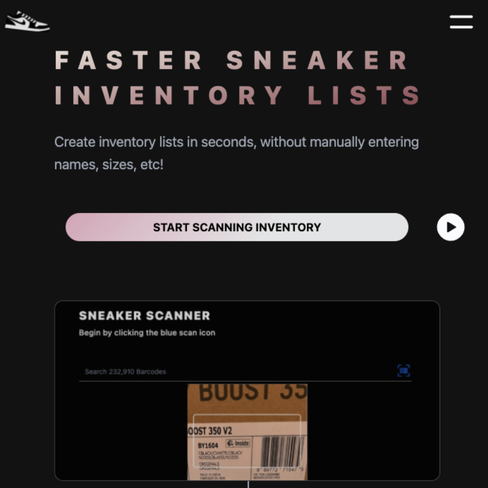
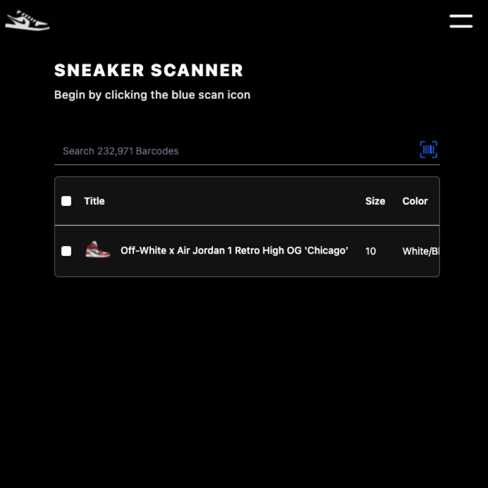
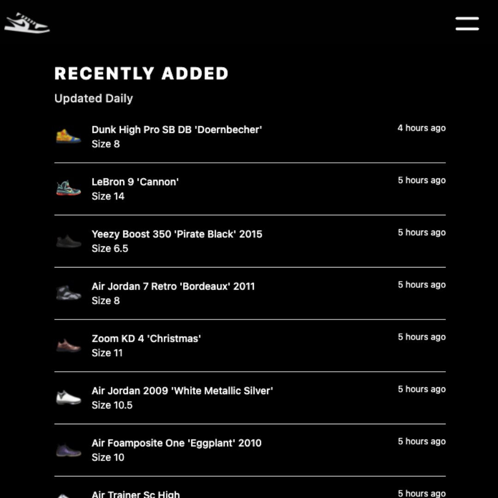
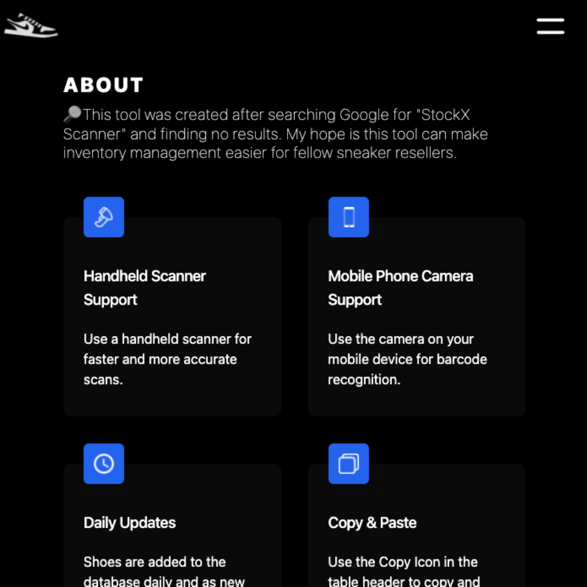
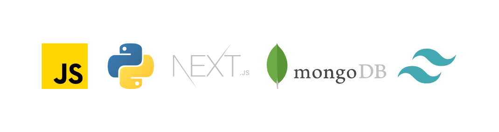

<h1 align="center">
   
  
   
  StockX Scanner
   
</h1>

<h4 align="center">Scan StockX Barcodes To Create Inventory Lists For Your Sneaker Reselling Business.</h4>

  <a href="#demo">Demo</a> •
  <a href="#key-features">Key Features</a> •
  <a href="#APIs-used">APIs Used</a> •
  <a href="#Built-with">Built With</a> •
  <a href="#Instagram">Instagram</a>

## Demo

* View [here](https://www.sneakerscan.io/)

## Key Features

* Quickly create inventory lists by scanning the barcode on your sneakers.
* Copy and paste into Excel, notes, etc.
* A Python script is running 24/7 to grow the barcode database.

## APIs Used

* I built my own API using Python to crawl the web and collect data which is then stored is MongoDB.

## Instagram

* [Instagram account](https://www.instagram.com/stockxscanner/) for Sneakscan.io

## Built With

* JavaScript
* Python
* Next.js
* Tailwind CSS
* Vercel
* MongoDB

